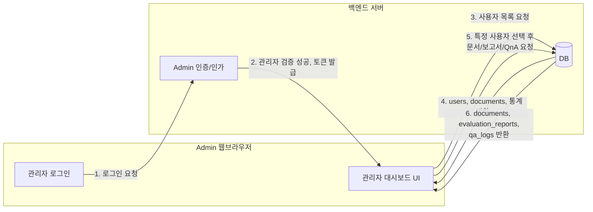

# RAG 시스템 + 관리자 워크플로 설계 정리

## 0. 최종 구조 한눈에 요약

- **File Search Store**
  - `main-store` : 모든 사용자 A 문서 저장
  - `rubric-store` : 평가 기준 B 문서 저장
- **로컬**
  - 원본 A 문서는 `/uploads/{random_key}.pdf` 형태로 저장
  - DB에는 `user_id`, `user_name`, `random_key`, `title`, `upload_time`, `store_name`, `fs_document_name` 등 메타데이터 저장
- **File Search 문서(`customMetadata`)**
  - `user_id`, `random_key` 등을 `customMetadata`로 저장해서  
    → QnA/RAG 호출 시 `metadataFilter`로 **특정 사용자·특정 문서만 검색**하도록 제한

이 패턴은 Google 공식 File Search 툴이 제공하는 RAG 워크플로(파일 업로드 → store에 import → generateContent에서 fileSearch 사용)와도 자연스럽게 맞는다.

---

## 1. 역할 구조 정리

- **일반 사용자 (user)**  
  - A 문서 업로드/삭제  
  - A 문서 QnA  
  - A 문서 평가(보고서 생성)  

- **관리자 (admin)**  
  - 관리자 대시보드 접속 (하드코딩된 계정 / 관리자 전용 로그인)  
  - 전체 사용자 목록 및 상태 조회  
  - 모든 A 문서 목록 / 보고서 열람  
  - 사용자별 QnA 로그(챗봇 대화 내역) 조회  
  - QnA용 / 평가용 **시스템 프롬프트 관리** (작성·수정·버전 관리)

---

## 2. File Search Store 전략

### 2-1. Store 구성

- `fileSearchStores/main-store`
  - 모든 **사용자 A 문서**를 넣는 공용 store
  - 각 문서는 아래와 같은 `customMetadata`를 가짐:
    - `user_id`: 내부 사용자 PK 또는 외부 ID
    - `random_key`: 로컬 파일명 겸 문서 식별자
- `fileSearchStores/rubric-store`
  - **평가 기준 문서 B**들을 모아두는 store
  - `customMetadata` 예:
    - `rubric_id`, `subject`, `grade_level` 등

File Search store는 “임베딩 컨테이너”이고, Files API로 올린 원본은 일정 시간이 지나면 삭제되지만 store 안에 import된 데이터는 직접 삭제하기 전까지 유지된다.  
따라서 **store 개수를 최소한으로 유지하고, 문서/사용자 구분은 metadata로 하는 것이 확장성에 유리**하다.

---

## 3. 로컬 DB & 파일 구조 (핵심 필드)

### 3-1. users 테이블 (개략)

- `id` (PK, 내부 user_id)
- `external_user_id` (OAuth ID, 학번 등)
- `name`
- `created_at`

최초 접속 시:

1. `external_user_id` + `name`으로 users 조회
2. 없으면 새 row 생성 → 내부 `user_id` 확보

---

### 3-2. documents 테이블 (A 문서 중심)

| 컬럼명             | 설명                                  |
|--------------------|---------------------------------------|
| `id`               | 문서 PK                               |
| `user_id`          | FK → users.id                         |
| `random_key`       | 랜덤 식별자(파일명/FS 매핑 키)       |
| `title`            | A 문서 제목                           |
| `upload_time`      | 업로드 시각                           |
| `local_path`       | `/uploads/{random_key}.pdf`           |
| `store_name`       | 예: `fileSearchStores/main-store`     |
| `fs_document_name` | 예: `fileSearchStores/main-store/documents/my-doc-abc123` |
| `status`           | `active` / `deleted`                  |

`fs_document_name`에 File Search Document의 전체 `name`을 저장해두면 나중에 삭제/재색인/마이그레이션 시 정확히 해당 문서를 다룰 수 있다.

---

## 4. 문서 A 업로드 플로우

1. **사용자 접속**
   - 클라이언트가 토큰/세션으로 `user.id`, `user.name`을 전달
   - 백엔드가 `users`에서 조회 후 없으면 새 row 생성 → 내부 `user_id` 확보

2. **A 문서 업로드 요청**
   - 요청 바디 (예시)
     - `file` (A 문서)
     - `title`
     - (필요 시) `assignment_id`, `evaluation_template_id` 등

3. **랜덤 키 생성 & 로컬 저장**
   - `random_key = uuid4()` 등으로 생성
   - 파일 저장: `/uploads/{random_key}.pdf`
   - `documents` 테이블에 row 생성  
     (`user_id`, `title`, `upload_time`, `random_key`, `local_path`, `status='active'`, `store_name='fileSearchStores/main-store'`)

4. **File Search Store에 업로드 + 인덱싱**
   - 한 번 만들어 둔 `main-store`를 사용:  
     `file_search_store_name = "fileSearchStores/main-store"`
   - `uploadToFileSearchStore` 또는 `files.upload + importFile`로 문서를 store에 import
   - 이때 `Document.customMetadata`에 다음을 넣는 컨셉:

     - `user_id = "<user_id>"`
     - `random_key = "<random_key>"`

   - 응답에서 `Document.name`을 받아 `documents.fs_document_name`에 저장

---

## 5. QnA 플로우 (A 문서 RAG 질의)

### 5-1. 화면 측

1. 사용자가 “A 문서 QnA 화면”으로 들어오면
   - DB에서 `documents`를 `user_id` + `doc_id` 또는 `random_key`로 조회
   - 리스트에서 선택된 문서의 `title`, `upload_time`, 미리보기 등을 표시
   - 내부적으로는 해당 문서의 `random_key`, `fs_document_name`을 보관

2. 사용자가 질문 입력

### 5-2. 백엔드 → File Search RAG 호출

1. 백엔드에서 보안을 위해 DB로 다시 검증
   - `user_id` + `random_key`로 `documents` 조회 (소유권 확인)

2. RAG 호출 (예시: TypeScript 스타일)

```ts
const response = await ai.models.generateContent({
  model: "gemini-2.5-flash",
  contents: userQuestion,
  config: {
    tools: [{
      fileSearch: {
        fileSearchStoreNames: [ "fileSearchStores/main-store" ],
        // 특정 사용자 + 특정 문서만 검색
        metadataFilter: `user_id="${userId}" AND random_key="${randomKey}"`
      }
    }]
  }
});
```

- `metadataFilter`를 사용하면, store 안에 여러 유저/문서가 섞여 있어도 **해당 사용자 + 해당 random_key에 해당하는 청크만** retrieval 대상이 된다.

3. File Search가 `main-store`에서 조건에 맞는 Document/Chunk를 찾아 모델에 컨텍스트로 제공
4. 모델이 답변 생성 → 백엔드 → 클라이언트로 전달

---

## 6. 관리자(어드민) 관련 DB 테이블

### 6-1. admins

| 컬럼명          | 설명                         |
|-----------------|------------------------------|
| `id`            | PK                           |
| `username`      | 관리자 계정명               |
| `password_hash` | 패스워드 해시               |
| `role`          | `superadmin`, `admin` 등    |
| `created_at`    | 생성일                       |

### 6-2. system_prompts (챗봇/평가용 시스템 프롬프트)

| 컬럼명               | 설명                            |
|----------------------|---------------------------------|
| `id`                 | PK                              |
| `type`               | `qna`, `evaluation` 등          |
| `name`               | 프롬프트 이름                  |
| `content`            | 실제 시스템 프롬프트 텍스트    |
| `is_active`          | 현재 사용 여부                  |
| `version`            | 버전 번호(1,2,3…)              |
| `created_by_admin_id`| FK(admins.id)                  |
| `created_at`         | 생성일                          |

### 6-3. qa_logs (사용자 QnA 로그)

| 컬럼명              | 설명                                           |
|---------------------|------------------------------------------------|
| `id`                | PK                                            |
| `user_id`           | FK(users.id)                                  |
| `doc_id`            | FK(documents.id)                              |
| `random_key`        | 해당 문서 랜덤 키                             |
| `question`          | 사용자가 입력한 질문                          |
| `answer`            | 모델이 반환한 답변                            |
| `model_name`        | 사용한 모델(`gemini-2.5-flash` 등)           |
| `used_prompt_version` | system_prompts.version                      |
| `created_at`        | QnA 발생 시각                                 |

---

## 7. 관리자 대시보드 주요 화면

1. **로그인 화면**
   - `/admin/login`  
   - `admins` 테이블 기반 인증 → JWT/세션 발급

2. **대시보드 홈**
   - 전체 사용자 수, 금일 업로드 문서 수, 금일 QnA 횟수, 금일 평가 실행 수 등 통계 카드
   - 최근 QnA, 최근 평가 보고서 리스트 일부

3. **사용자 관리 화면**
   - `users` 테이블 리스트
   - 검색: 이름, external_user_id, 가입일 등
   - 클릭 시 사용자 상세:
     - 해당 사용자의 문서 목록 (documents)
     - 각 문서의 평가 보고서 목록 (evaluation_runs / evaluation_reports)
     - QnA 로그 (qa_logs)

4. **보고서 관리 화면**
   - 전체 평가 보고서 리스트
   - 필터: 사용자, 과제, 기간, 점수 범위 등
   - 각 보고서 클릭 시 상세 보기 (평가 기준, 점수, 피드백 등)

5. **QnA 로그 뷰어**
   - `qa_logs` 기준으로 전체 QnA 내역 테이블
   - 필터:
     - user_id / 이름
     - doc_id / 제목
     - 날짜 범위
   - 한 행 클릭:  
     - 좌측: 사용자 질문  
     - 우측: 모델 답변, 사용된 system prompt 버전, 모델 이름 등

6. **시스템 프롬프트 관리 화면**
   - `system_prompts` 리스트
   - type별 탭(QnA, 평가 등)
   - 기능:
     - 새 프롬프트 생성 (새 버전)
     - 기존 프롬프트 내용 보기
     - 특정 프롬프트를 `is_active=true`로 설정 (나머지는 false 처리)
     - 필요하다면 이전 버전과 diff 비교

---

## 8. 관리자 워크플로 A: 사용자 현황 / 보고서 / QnA 조회

### 8-1. 플로우 다이어그램 (개념)



### 8-2. 시나리오 예시 요약

1. 관리자가 `/admin/login`으로 접속하여 로그인.
2. 홈 화면에서 통계(사용자 수, 업로드 수, QnA 횟수, 평가 실행 수)를 확인.
3. “사용자 목록” 메뉴 → 특정 사용자 클릭 → 해당 사용자의 A 문서 리스트 조회.
4. 문서 선택 → 해당 문서의 평가 보고서 / QnA 로그를 상세 조회.

---

## 9. 관리자 워크플로 B: 시스템 프롬프트 관리 및 반영

### 9-1. 플로우 다이어그램 (개념)

```mermaid
sequenceDiagram
    participant Admin as 관리자
    participant AdminUI as Admin 대시보드
    participant API as Backend API
    participant DB as DB
    participant Chat as QnA/평가 API

    Admin->>AdminUI: 1. "시스템 프롬프트 관리" 화면 진입
    AdminUI->>DB: 2. system_prompts 리스트 조회
    DB-->>AdminUI: 3. 기존 프롬프트/버전 목록

    Admin->>AdminUI: 4. 새 프롬프트 작성/수정
    AdminUI->>API: 5. 새 프롬프트 저장 요청
    API->>DB: 6. system_prompts INSERT (version+1,
 is_active=true), 기존 active=false 처리
    DB-->>API: 7. 저장 완료
    API-->>AdminUI: 8. 성공 응답

    Chat->>DB: 9. (사용자 QnA/평가 발생 시)
현재 active 프롬프트 조회
    DB-->>Chat: 10. 최신 active system_prompt 반환
    Chat-->>Chat: 11. 이 프롬프트를 system 메시지로 사용해
Gemini generateContent 호출
```

### 9-2. 핵심 포인트 요약

- QnA/평가 API는 매 요청마다 `system_prompts`에서 `is_active=true`인 최신 프롬프트를 읽어 사용.
- `qa_logs.used_prompt_version`에 사용된 프롬프트 버전을 기록해 두어, 나중에 프롬프트 변경 전후 품질 비교 가능.

---

## 10. 전체 시스템에서 관리자 워크플로의 위치

- **사용자 측**
  - A 문서 업로드 → 로컬 저장 + `main-store` 인덱싱 (`user_id`, `random_key` 메타데이터)
  - A 문서 QnA → `metadataFilter`로 해당 사용자+문서만 RAG
  - A 문서 평가 → `main-store` + `rubric-store` 함께 사용, 평가 템플릿/프롬프트 적용
  - QnA/평가 결과는 `qa_logs`, `evaluation_reports`에 누적

- **관리자 측**
  - 관리자 로그인 → 사용자/문서/보고서/QnA 전체 조회
  - `qa_logs`를 통해 사용자별/문서별 대화 내역 모니터링
  - `system_prompts`를 통해 QnA/평가 프롬프트 관리·버전 업
  - 변경된 프롬프트는 이후 모든 QnA/평가 API 호출에 자동 반영

이 구조를 통해,
- 사용자는 자신의 데이터만 안전하게 사용하고,
- 관리자는 전체 시스템 상태와 품질을 관찰·조정할 수 있는 RAG 기반 평가/피드백 시스템을 운영할 수 있다.
