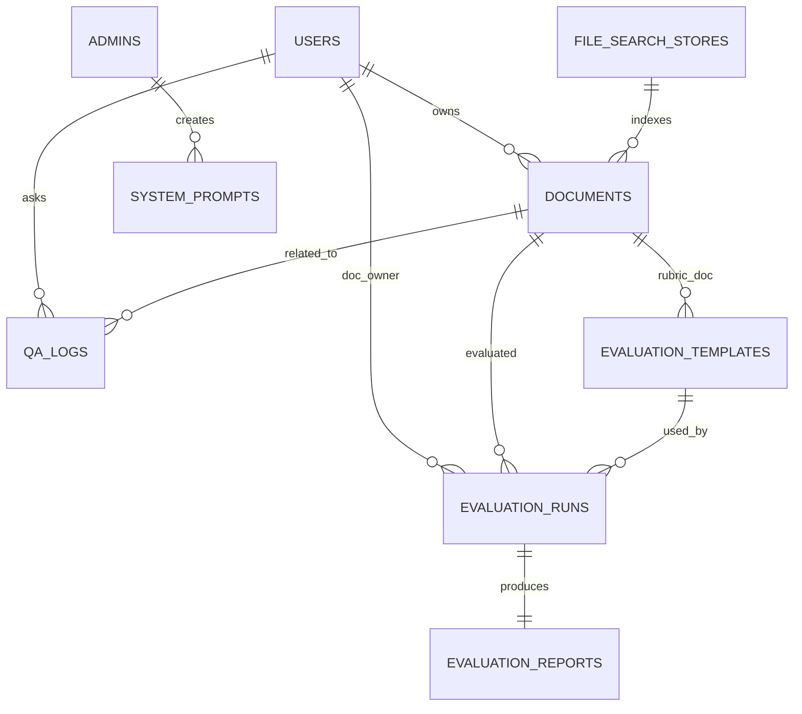

# RAG 시스템 ERD 설계 문서

## 1. ERD 다이어그램 (Mermaid)

관계 요약:

- **USERS – DOCUMENTS** : 1:N (한 사용자는 여러 A 문서 소유)
- **USERS – QA_LOGS** : 1:N (한 사용자가 여러 QnA 기록)
- **USERS – EVALUATION_RUNS** : 1:N (해당 사용자의 문서에 대한 여러 평가 실행)
- **ADMINS – SYSTEM_PROMPTS** : 1:N (관리자가 여러 시스템 프롬프트 생성)
- **FILE_SEARCH_STORES – DOCUMENTS** : 1:N (하나의 store에 여러 문서 인덱싱)
- **DOCUMENTS – QA_LOGS** : 1:N (하나의 문서에 여러 QnA 로그)
- **DOCUMENTS – EVALUATION_RUNS** : 1:N (하나의 문서가 여러 번 평가될 수 있음)
- **EVALUATION_RUNS – EVALUATION_REPORTS** : 1:1 (한 실행당 하나의 보고서)
- **EVALUATION_TEMPLATES – EVALUATION_RUNS** : 1:N (템플릿 하나로 여러 평가 실행)
- **DOCUMENTS – EVALUATION_TEMPLATES** : 1:N (rubric용 B 문서와 템플릿 연결, 선택 사항)

---

## 2. 테이블 정의

### 2.1 USERS

| 컬럼명             | 타입/설명                        |
|--------------------|----------------------------------|
| `id` (PK)          | 내부 user_id                     |
| `external_user_id` | 외부 인증 ID(학번, OAuth 등)    |
| `name`             | 사용자 이름                      |
| `email`            | 이메일(선택)                    |
| `role`             | `user`, `teacher` 등 (선택)     |
| `created_at`       | 생성 시각                        |

---

### 2.2 ADMINS

| 컬럼명          | 타입/설명                         |
|-----------------|-----------------------------------|
| `id` (PK)       | 관리자 ID                         |
| `username`      | 관리자 계정명                    |
| `password_hash` | 비밀번호 해시                    |
| `role`          | `superadmin`, `admin` 등         |
| `created_at`    | 생성 시각                         |

---

### 2.3 FILE_SEARCH_STORES

| 컬럼명        | 타입/설명                                       |
|---------------|-------------------------------------------------|
| `id` (PK)     | 내부용 식별자                                   |
| `owner_type`  | `"system"` 또는 `"user"`                        |
| `owner_id`    | 소유자 ID (system이면 null)                    |
| `store_name`  | `fileSearchStores/main-store` 등 Gemini store name |
| `description` | 설명 (예: main-store, rubric-store)            |
| `created_at`  | 생성 시각                                       |

---

### 2.4 DOCUMENTS (A/B 문서 공통)

| 컬럼명             | 타입/설명                                                |
|--------------------|----------------------------------------------------------|
| `id` (PK)          | 문서 ID                                                 |
| `user_id` (FK)     | USERS.id (A 문서일 때 필수, B 문서는 null 가능)        |
| `role`             | `"A"` 또는 `"B"` (A: 제출 문서, B: 평가 기준 문서)     |
| `title`            | 문서 제목                                               |
| `random_key`       | 로컬 파일명/식별자 (`/uploads/{random_key}.pdf`)       |
| `upload_time`      | 업로드 시각                                             |
| `local_path`       | 로컬 저장 경로                                          |
| `store_id` (FK)    | FILE_SEARCH_STORES.id                                   |
| `fs_document_name` | File Search Document name (`fileSearchStores/.../documents/...`) |
| `mime_type`        | `application/pdf` 등                                    |
| `lang`             | 문서 언어 (`ko`, `en` 등, 선택)                         |
| `status`           | `active`, `deleted` (soft delete 대비)                  |

---

### 2.5 EVALUATION_TEMPLATES (평가 템플릿 + B 문서 연결)

| 컬럼명             | 타입/설명                                        |
|--------------------|--------------------------------------------------|
| `id` (PK)          | 템플릿 ID                                       |
| `name`             | 템플릿 이름 (예: “논문 평가 v1”)                |
| `description`      | 설명                                            |
| `rubric_doc_id` FK | DOCUMENTS.id (B 문서 ID)                        |
| `system_prompt_id` | SYSTEM_PROMPTS.id (평가용 프롬프트 연결, 선택)   |
| `model_name`       | 사용 모델 (`gemini-2.5-pro` 등)                 |
| `created_by` (FK)  | ADMINS.id 또는 USERS.id                         |
| `created_at`       | 생성 시각                                        |

---

### 2.6 EVALUATION_RUNS (평가 실행 기록)

| 컬럼명             | 타입/설명                                           |
|--------------------|-----------------------------------------------------|
| `id` (PK)          | 평가 실행 ID                                       |
| `user_id` (FK)     | 평가 대상 A 문서의 소유자 USERS.id                 |
| `doc_id` (FK)      | 평가 대상 A 문서 DOCUMENTS.id                      |
| `template_id` (FK) | 사용한 평가 템플릿 EVALUATION_TEMPLATES.id          |
| `requested_by` (FK)| 평가 요청 주체 (교사/관리자) USERS.id 또는 ADMINS.id |
| `status`           | `pending`, `success`, `error` 등                   |
| `model_name`       | 실제 사용한 모델 이름                              |
| `started_at`       | 평가 시작 시각                                      |
| `finished_at`      | 평가 종료 시각                                      |

---

### 2.7 EVALUATION_REPORTS (평가 결과/보고서)

| 컬럼명        | 타입/설명                                         |
|---------------|---------------------------------------------------|
| `id` (PK)     | 보고서 ID                                         |
| `run_id` (FK) | EVALUATION_RUNS.id                                |
| `score`       | 총점 또는 등급                                   |
| `rubric_scores` | jsonb, 항목별 점수/피드백                       |
| `summary`     | 요약 평가                                         |
| `full_report` | 전체 보고서 텍스트                                |
| `created_at`  | 생성 시각                                         |

---

### 2.8 SYSTEM_PROMPTS (QnA/평가용 시스템 프롬프트)

| 컬럼명               | 타입/설명                                  |
|----------------------|--------------------------------------------|
| `id` (PK)           | 시스템 프롬프트 ID                         |
| `type`              | `qna`, `evaluation`, `other` 등            |
| `name`              | 프롬프트 이름                              |
| `content`           | 실제 시스템 프롬프트 텍스트                |
| `is_active`         | 현재 사용 여부                             |
| `version`           | 버전 번호 (1,2,3…)                        |
| `created_by_admin_id` (FK) | ADMINS.id                           |
| `created_at`        | 생성 시각                                   |

---

### 2.9 QA_LOGS (사용자 QnA 로그)

| 컬럼명              | 타입/설명                                         |
|---------------------|---------------------------------------------------|
| `id` (PK)           | QnA 로그 ID                                      |
| `user_id` (FK)      | USERS.id                                         |
| `doc_id` (FK)       | DOCUMENTS.id (A 문서)                            |
| `random_key`        | 해당 문서 랜덤 키                                |
| `question`          | 사용자가 입력한 질문                             |
| `answer`            | 모델이 반환한 답변                               |
| `model_name`        | 사용한 모델                                      |
| `used_prompt_id` FK | SYSTEM_PROMPTS.id                                |
| `created_at`        | QnA 발생 시각                                    |

---

이 ERD 문서는 RAG + 평가 + 관리자 대시보드까지 모두 포함한 DB 설계의 기준으로 사용할 수 있다.
